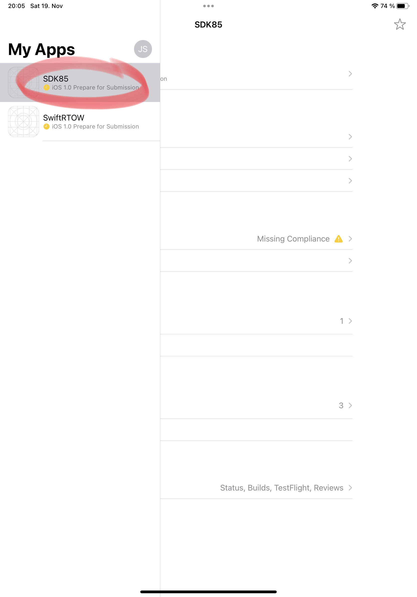
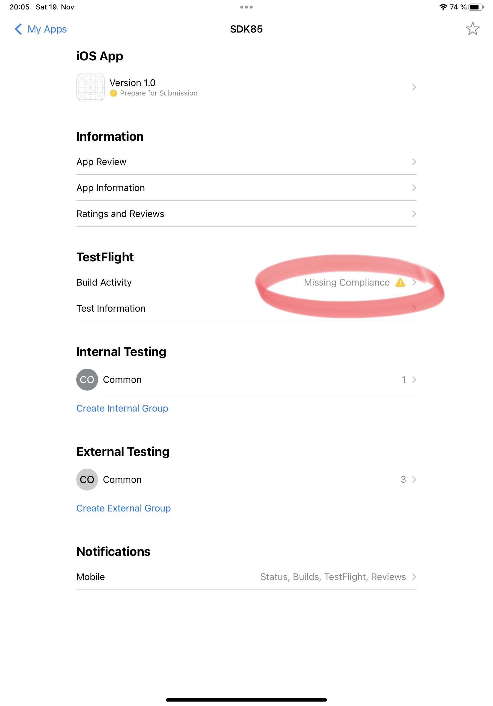
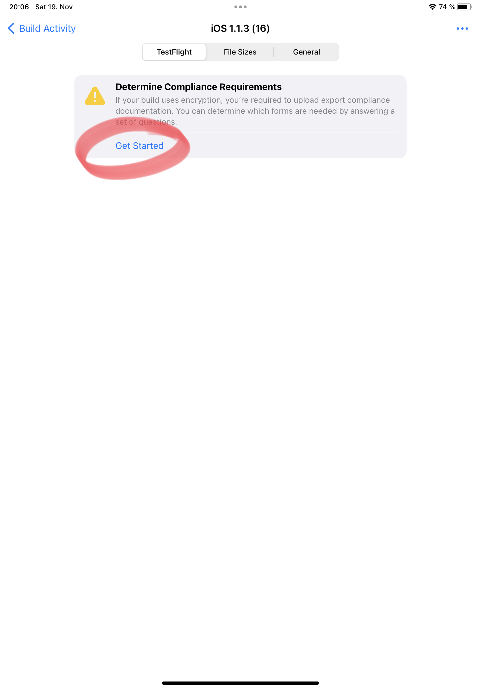
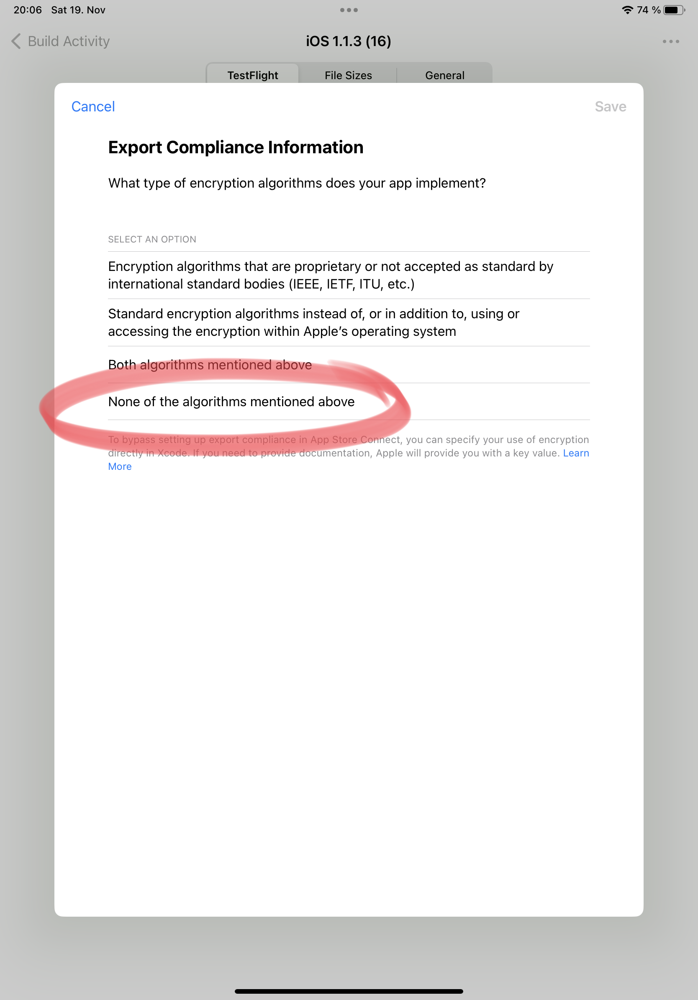
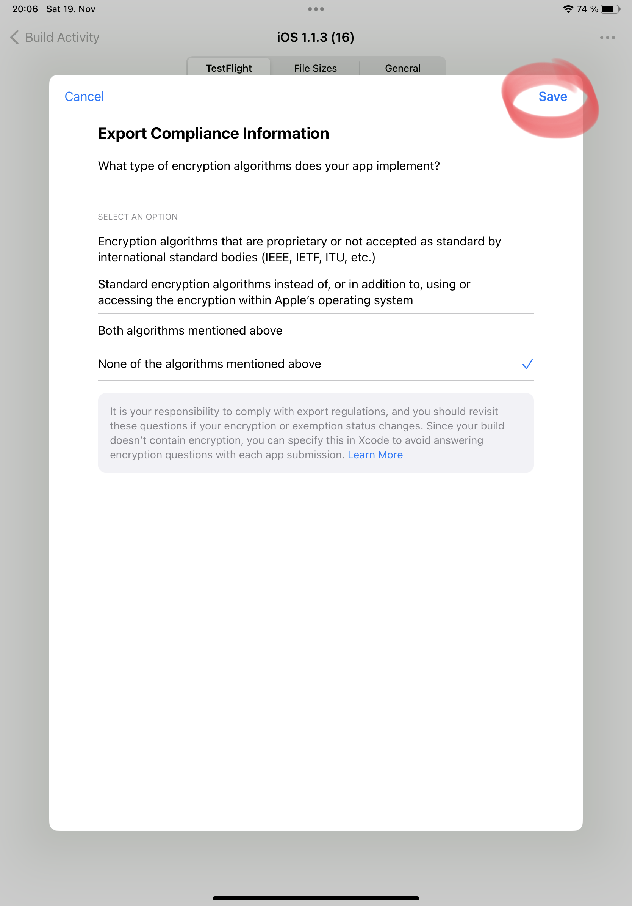

# SDK85

A kind of replica of the [Intel SDK-85](https://en.wikipedia.org/wiki/Intel_System_Development_Kit#SDK-85) for iPadOS. The app uses an Z80 emulator instead of 8085, so the original ROM required changes: The RIM and SIM instructions for reading and writing serial data on the SID and SOD pins of the 8085 have been replaced by IN 0xFF and OUT 0xFF, respectively. Masking interrupts with RIM and SIM have been replaced by NOP instructions. 8085’s interrupts TRAP (4.5), RST 5.5 and RST 7.5 are handled by Z80’s NMI and INT. There is no support for RST 6.5. The changes make the new monitor a few bytes larger than the old one's 2 kB and is burned into a 4 kB ROM.

**Note:** The call addresses of the monitor routines have changed due to modifications to the original monitor. The program examples on page 6-4 ff. of the printed manual use these routines and must be adapted accordingly. The values can be found in the file [sdk85.lst](sdk85.lst).

The original ROM was taken from the *SDK-85 User's Manual* ([PDF](http://retro.hansotten.nl/uploads/sdk85/9800451B.pdf)). A transcript of the relevant pages (67 - 93) had been done with [AWS Textract](https://aws.amazon.com/textract/), followed by numerous AWK scripts, and eventually manually edited. Though the assembler is happy, overseen errors might still hide in the code.

### Usage

Swipe the main view left to enter the TTY monitor, and right to return to the keyboard monitor. See _User's Manual_ for the usage of either. Switching between monitors yields CPU restart without preserving RAM. Long-tap PCB to load a user program file with 8085 machine code at 0x2000.

**Working**
- GO command (run a program, set SP before (!))
- SUBST MEM command (enter a program)
- EXAM REG command (examine/ set registers)
- SINGLE STEP command (debug a program, set SP before (!))
- VECT INTR command (immediate RST 7.5)
- TTY monitor (rather simple implementation)

**Wanted**
- Improved 8279 (keyboard/ display interface)
- 8155 support (RAM, I/O ports and timer)

**Example (video)**
1. Set stack pointer (EXAM REG) to address 0x20C2
2. Enter program (SUBST MEM) at address 0x2000:

   |No|Opcode(s)|Mnemonic|Description|
   |:---|:---|:---|:---|
   |1|3E 42|MVI A,42H|Load register A with 0x42.|
   |2|CF|RST 1|Jump to warm start routine.|
3. Run programm (GO) at address 0x2000
4. Check value in register A (EXAM REG)

https://user-images.githubusercontent.com/16709212/191330797-6c84e86a-3d4a-4d4d-8560-75289ef487b6.mp4

### Tools
Apps used on iPad
- [Swift Playgrounds 4](https://apps.apple.com/de/app/swift-playgrounds/id908519492) (SP4)
- [Working Copy](https://workingcopyapp.com/) (WC)
- [Textastic](https://www.textasticapp.com/) (can handle files in *Swift Playgrounds* and *Working Copy* folders)
- [GitHub](https://apps.apple.com/us/app/github/id1477376905)
- [App Store Connect](https://apps.apple.com/de/app/app-store-connect/id1234793120) (Connect)
- [TestFlight](https://apps.apple.com/de/app/testflight/id899247664) (TF)
- [UniChar](https://apps.apple.com/de/app/unichar-unicode-keyboard/id880811847) (Unicode keyboard)
 
Apps used on Winos or Linos
- [8085 assembler](https://github.com/TomNisbet/asm85) (optional)
- [Cygwin](https://www.cygwin.com/) with development tools (to compile 8085 assembler on Winos)

### Build
- Create and open a new app in SP4
- Delete predefined `*.swift` files
- Copy Swift files (except `Package.swift`) from repository:
  - Get repository on iPad (Working Copy)
  - Copy Sources folder from WC to SP4 (Textastic)
- Add `additionalInfoPlistContentFilePath` and `resources` keys to `Package.swift` in new app
  - Lookup key templates in repository's `Package.swift`
- Add [Z80 emulator package](https://github.com/otabuzzman/z80)
- Add files from `Recources` folder in WC: 
  - Add monitor program
  - Add background photo
  - Add key press/ release sound files

### Upload to TestFlight[^1]
- Close app in SP4
- Update `displayVersion` and `bundleVersion` in `Package.swift` (Textastic)
  |    |    |    |    |
  |:---|:---|:---|:---|
  |1) Upload app in SP4. Wait for email confirmation (<5 minutes)|2) Select app in Connect|3) Click _Build Activity_ in _TestFlight_ section|4) Select latest build|
  |||||
  |5) Set _Export Compliance Information_ (1)|6) Set _Export Compliance Information_ (2)|7) Save _Export Compliance Information_. Wait for email confirmation (<5 minutes)|8) Install app in TestFlight|
  |||||
 
[^1]: [Apple Developer Program](https://developer.apple.com/programs/) subscription required ($).

### Which file for what
|File|Comment|
|:---|:------|
|SDK85.LST|Monitor transcription (ISIS-II 8080/8085 MACRO ASSEMBLER).|
|SDK85.SRC|Monitor assembler source (ISIS-II 8080/8085 MACRO ASSEMBLER) generated from SDK85.LST.|
|sdk85-0000.bin|Monitor ROM image made with 8085 assembler (asm85).|
|SDK85-UM-9800451A-1977.pdf|SDK-85 User's Manual, issue from '77.|
|SDK85-UM-9800451B-1980.pdf|SDK-85 User's Manual, issue from '80.|
|Intel/SDK85.pdf|Pages with monitor listing taken from SDK-85 User's Manual.|
|sdk85-keyprease.mp3|Original SDK-85 key press/ release sounds.|
|sdk85-keypress.mp3|Original SDK-85 key press sound.|
|sdk85-keyrelease.mp3|Original SDK-85 key release sound.|
|vt100-keyprease-alpha.mp3|Original ([YT](https://www.youtube.com/watch?v=QW_uu-B1kbg)) VT100 alpha key press/ release sound.|
|vt100-keyprease-enter.mp3|Original VT100 enter key press/ release sound.|
|vt100-keyprease-space.mp3|Original VT100 space key press/ release sound.|
|vt100-keypress-shift.mp3|Original VT100 shift key press sound.|
|FontInfo.plist|Additional property file for custom fonts.|
|Glass_TTY_VT220.ttf|Glass TTY VT220 font file.|
|DECTerminalModerm.ttf|DEC Terminal Modern font file.
|Resources/sdk85-pcb.jpg|Photo of SDK-85 printed circuit board.|
|Sdk85.swift|The main program.|
|IntIO.swift|Interrupts and I/O ports abstraction for Z80 emulator. Glue code between Z80 emulator and SwiftUI.|
|I8279.swift|8279 keyboard/ display interface abstraction. Glue code between Z80 emulator and SwiftUI.|
|Pcb.swift|SDK-85 PCB view with keyboard and display views.|
|Hexboard.swift|SDK-85 hex keyboard view.|
|Display.swift|SDK-85 display view.|
|Tty.swift|Simple terminal view for TTY monitor usage.|
|Keyboard.swift|SDK-85 terminal keyboard view.|
|Monitor.swift|SDK-85 terminal monitor view.|
|BinFileLoader.swift|File picker view to load custom MONITOR or user programs.|
|BarreledRectangle.swift|A barrel-shaped rectangle.|
|TriangledRectangle.swift|A double-crossed rectangle.|
|SevenSegmentDisplay.swift|A single seven segment digit.|
|Sound.swift|A simple sound file player.|
|Queue.swift|A queue (FIFO) implementation.|
|BatterySaver.swift|An overlay view to resume execution.|
|UserDefaults.swift|Settings and app-wide default values.|
|sdk85.asm|Monitor assembler source (asm85) hand-crafted from SDK85.SRC.|
|sdk85.lst|Monitor assembler (asm85) listing.|

### License
Copyright (c) 2022 Jürgen Schuck

Permission is hereby granted, free of charge, to any person obtaining a copy of this software and associated documentation files (the „Software“), to deal in the Software without restriction, including without limitation the rights to use, copy, modify, merge, publish, distribute, sublicense, and/or sell copies of the Software, and to permit persons to whom the Software is furnished to do so, subject to the following conditions:

The above copyright notice and this permission notice shall be included in all copies or substantial portions of the Software.

THE SOFTWARE IS PROVIDED „AS IS“, WITHOUT WARRANTY OF ANY KIND, EXPRESS OR IMPLIED, INCLUDING BUT NOT LIMITED TO THE WARRANTIES OF MERCHANTABILITY, FITNESS FOR A PARTICULAR PURPOSE AND NONINFRINGEMENT. IN NO EVENT SHALL THE AUTHORS OR COPYRIGHT HOLDERS BE LIABLE FOR ANY CLAIM, DAMAGES OR OTHER LIABILITY, WHETHER IN AN ACTION OF CONTRACT, TORT OR OTHERWISE, ARISING FROM, OUT OF OR IN CONNECTION WITH THE SOFTWARE OR THE USE OR OTHER DEALINGS IN THE SOFTWARE.

#### SDK-85 System Design Kit User’s Manual
Copyright (c) 1978 Intel Corporation

Intel Corporation makes no warranty of any kind with regard to this material, including, but not limited to, the implied warranties of merchantability and fitness for a particular purpose. Intel Corporation assumes no responsibility for any errors that may appear in this document. Intel Corporation makes no commitment to update nor to keep current the information contained in this document.

Intel Corporation assumes no responsibility for the use of any circuitry other than circuitry embodied in
an Intel product. No other circuit patent licenses are implied.

Intel software products are copyrighted by and shall remain the property of Intel Corporation. Use, duplication or disclosure is subject to restrictions stated in Intel’s software license, or as defined in ASPR 7-104.9(a)(9).

No part of this document may be copied or reproduced in any form or by any means without the prior written consent of Intel Corporation.

#### SDK-85 printed circuit board photo
[Photo](http://retro.hansotten.nl/wp-content/uploads/2021/03/20210318_112214-scaled.jpg) by [Hans Otten](http://retro.hansotten.nl/contact/) licensed under [CC BY-NC-SA 4.0](https://creativecommons.org/licenses/by-sa/4.0/deed.en).

#### SDK-85 key press/ release sound files
Recordings kindly provided by [Hans Otten](http://retro.hansotten.nl/contact/).

#### Z80 emulator package (referenced)
[License information](https://github.com/otabuzzman/z80#license) in emulator’s repository.

#### Glass TTY VT220 font
Viacheslav Slavinsky

This is free and unencumbered software released into the public domain.

Anyone is free to copy, modify, publish, use, compile, sell, or
distribute this software, either in source code form or as a compiled
binary, for any purpose, commercial or non-commercial, and by any
means.

In jurisdictions that recognize copyright laws, the author or authors
of this software dedicate any and all copyright interest in the
software to the public domain. We make this dedication for the benefit
of the public at large and to the detriment of our heirs and
successors. We intend this dedication to be an overt act of
relinquishment in perpetuity of all present and future rights to this
software under copyright law.

THE SOFTWARE IS PROVIDED "AS IS", WITHOUT WARRANTY OF ANY KIND,
EXPRESS OR IMPLIED, INCLUDING BUT NOT LIMITED TO THE WARRANTIES OF
MERCHANTABILITY, FITNESS FOR A PARTICULAR PURPOSE AND NONINFRINGEMENT.
IN NO EVENT SHALL THE AUTHORS BE LIABLE FOR ANY CLAIM, DAMAGES OR
OTHER LIABILITY, WHETHER IN AN ACTION OF CONTRACT, TORT OR OTHERWISE,
ARISING FROM, OUT OF OR IN CONNECTION WITH THE SOFTWARE OR THE USE OR
OTHER DEALINGS IN THE SOFTWARE.

For more information, please refer to <[https://unlicense.org](https://unlicense.org)>

#### DEC Terminal Modern font
Copyright (c) 2015 Dan Mecklenburg Jr.

Free for personal use.
